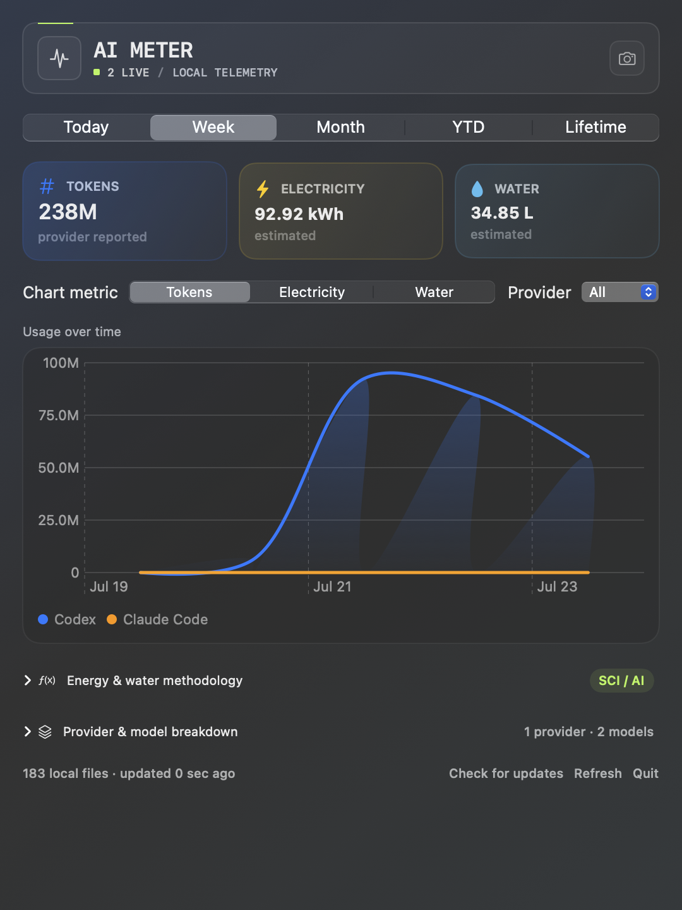

# AI Meter

A native macOS menu-bar app that measures token usage across Codex, Claude Code,
Cursor, OpenCode, and Gemini CLI, then estimates the associated electricity and
direct cooling-water use. Token counts come from local records; environmental
values are transparent, adjustable scenarios—not provider measurements.

[Website](https://ai-meter.app/) ·
[Download for macOS](https://github.com/yash1195/ai-meter/releases/latest/download/AI-Meter.dmg) ·
[Methodology](METHODOLOGY.md) ·
[Privacy](PRIVACY.md)

<p align="center">
  
</p>

AI Meter currently reads:

| Coding harness | Local source | Status |
| --- | --- | --- |
| Codex | `$CODEX_HOME/sessions/**/*.jsonl` (default `~/.codex`) | Provider-reported cumulative usage |
| Claude Code | `$CLAUDE_CONFIG_DIR/projects/**/*.jsonl` (default `~/.claude`) | Provider-reported message usage |
| OpenCode | `$XDG_DATA_HOME/opencode/opencode*.db` (default `~/.local/share`) | Provider-reported message usage |
| Gemini CLI | `$GEMINI_CLI_HOME/.gemini/tmp/**/chats/**/*.jsonl` (default `~`) | Provider-reported message usage |
| Cursor | `~/Library/Application Support/Cursor/User/globalStorage/state.vscdb` | Local per-response token counts; timeline estimated |

Model names are discovered from the records rather than kept in a hard-coded
model list. New OpenAI, Anthropic, Google, OpenCode, gateway, or local model
names therefore appear automatically when a supported harness records them.
Cursor does not currently retain model names alongside its local token counters,
so its usage appears under `Cursor model (not recorded locally)`.

It extracts usage metadata without retaining or transmitting prompt, response,
source-code, or tool-output content. See [PRIVACY.md](PRIVACY.md) for the exact
data boundary and update-check network behavior.

## Dashboard

- Clicking the menu-bar total opens a native dropdown dashboard.
- Periods: Today, This Week, Month, Year to Date, and Lifetime.
- Interactive hourly, daily, or monthly chart with one series per coding harness.
- Provider filters and provider/model breakdowns from actual local metadata.
- Token, estimated electricity, and estimated water chart modes.
- Familiar Tesla Model 3 driving-distance and WaterSense-shower equivalents beside impact totals.
- SCI for AI-aligned methodology with adjustable environmental assumptions.
- Live header activity meter driven by recent local token throughput.
- Immediate startup from a derived on-device usage cache while sources refresh.
- Secure in-app update checks and installation.
- Copy an exact PNG screenshot of the visible widget using the Screenshot button.

## Run during development

```sh
swift run AIUsageMonitor
```

## Install an official release

Download the latest `AI-Meter.dmg`, open it, and drag AI Meter into
**Applications**. The disk image is signed and notarized by Apple.

Alternatively, install from Terminal:

```sh
curl -fsSL https://ai-meter.app/install.sh | sh
```

The installer downloads the latest `AI-Meter.dmg`, verifies the bundle ID,
Apple code signature, Gatekeeper approval, and Developer ID team, then installs
AI Meter in `/Applications`. macOS may ask for administrator permission. You
can inspect [install.sh](install.sh) before running it.

## Quit and uninstall

Open AI Meter from the menu bar and select **Quit** at the bottom of the
dashboard.

To uninstall it, quit AI Meter and move `/Applications/AI Meter.app` to the
Trash. AI Meter does not modify or remove coding-agent session files. You may
optionally remove its derived local cache and preferences:

- `~/Library/Caches/com.zeko.aimeter`
- `~/Library/Preferences/com.zeko.aimeter.plist`

## Test

```sh
swift test
```

## Build a local `.app`

```sh
chmod +x scripts/build-app.sh
scripts/build-app.sh
open "dist/AI Meter.app"
```

The script creates a universal application for Apple Silicon and Intel Macs.
The generated application is intended for local development and is not signed
or notarized. A distributable build should use a Developer ID certificate and
Apple notarization.

## Counting rules

- Codex emits cumulative session totals. AI Meter records only the positive
  delta from one `token_count` event to the next.
- Codex cached input is a subset of its reported input, so it is not added a
  second time.
- Claude Code reports ordinary input, cache creation, cache reads, and output
  separately; all four categories contribute to the total.
- OpenCode stores normalized input, cache, output, and reasoning counts in its
  local SQLite message ledger. Reasoning is included once in the token total.
- Gemini CLI stores per-response input, cached, output, thought, and total
  counts in its local chat recordings.
- Cursor stores per-response input and output counts in its local chat database.
  It does not retain a wall-clock timestamp for each response, so AI Meter keeps
  the exact token total and places responses in order between the conversation's
  creation and last-update timestamps.
- Repeated message records are deduplicated by harness and message ID.
- Events are assigned to a day using the Mac's current calendar and time zone.

## Compatibility policy

AI Meter prefers documented, stable local usage records. Cursor documents that
chat history is stored in a local SQLite database, but its token metadata schema
is not public. Cursor support is therefore defensive and may need updates if
Cursor changes that schema. AI Meter selects only token and conversation timing
metadata from the database; it never reads Cursor credentials or estimates
tokens from message text. GitHub Copilot and Aider are not currently counted
because they do not expose an equivalent local token ledger.

## Environmental estimates

Environmental values are scenarios, not provider measurements. AI Meter follows
the SCI for AI consumer boundary and uses provider-reported tokens as its
functional unit. The defaults are:

- `0.39 facility kWh / 1M tokens`, calibrated from a production-scale inference
  midpoint of `0.31 Wh` for a representative 800-token query.
- `1.20` PUE, within the `1.05–1.40` hyperscale range used by the inference study.
- `0.45 L / IT kWh` site WUE, based on the U.S. national-lab data-center
  scenario range.

The dashboard calculates direct site water as
`facility energy ÷ PUE × site WUE`. All assumptions are adjustable. See
[METHODOLOGY.md](METHODOLOGY.md) for the derivation, boundaries, uncertainty,
and primary sources.

## Updates

AI Meter periodically checks for updates without sending local usage data.
Starting with AI Meter 0.2.1, the **Install update** button uses
[Sparkle](https://sparkle-project.org/) to verify, install, and relaunch signed
updates in place. No DMG dragging is required for subsequent updates.

Sparkle is distributed under its permissive license. Its full license and
third-party notices are bundled inside AI Meter.

## License

Official, unmodified AI Meter releases are free for individuals and companies
to install and use, including for internal commercial business use. The public
source is available for evaluation and security review, but source copying,
modification, redistribution, deployment, and product replication are not
permitted without written permission. This is source-available software, not
open source. See [LICENSE](LICENSE).
